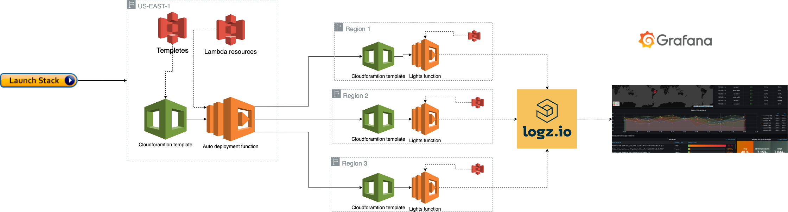

## How it works
LightS is deployed on AWS in two steps:
###  Step 1:
The `auto-deployment.yaml` cloudformation template is used to deploy the `auto deployment` lambda function with supporting resources in `us-east-1` region.
###  Step 2:
The `auto deployment` lambda function iterates threw all regions spesified in `regions` parmeter, and deployes the `Ligth S` lambda function with supporting resources in every region. Each region has a dedicated cloudformation template with the name `sm-stack-{region_code}.yaml`.
#### Pseudo code:
```python
validate_inputs()

for each region in regions_input:
    deploy_stack()

delete_auto_deployment_stack()
```

#### Scheme:


All cloudformation templetes and the code for all lambda functions are stored in S3 bucktes with public read permissions managed by Logz.io.

